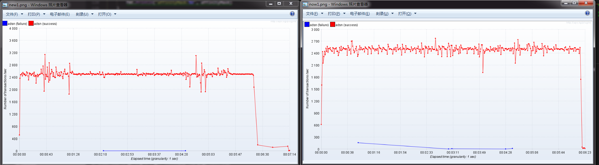

# 腾蛇(WingedSnake)
腾蛇是模仿nginx实现的服务端框架
## 支持
热重启  
守护进程  
配置文件热更新
## 效果截图
  
## 使用帮助
参考examples内的实现
## 效果对比

左侧为使用腾蛇效果
右侧为使用runtime.GOMAXPROCS效果
## 备注
1.内部自带CPU 亲和配置 不提倡再使用 runtime.GOMAXPROCS 函数  
2.不支持windows
